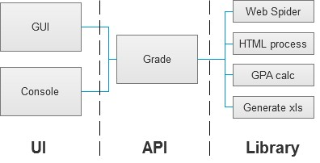

# StuInfoTool
A tool of DLNU Web, Using Python to fetch useful information,showing with desktop GUI.More quickly get info than using normal website.

## Framework

## Functions
>
> Display term or whole grade 
>
> Calculate GPA,providing SIX kinds of calculation methods
>
> Output .xls
>
> Support SSL proxy
>

## Requirements

> Python 2.7+
>
> Requests
>
> BeautifulSoup 4
>
> PyQt 4
> 
> xlwt
> 

## Contributors

> [Vic020](http://vicyu.net)
> [JonnyF](http://jonnyf.com)